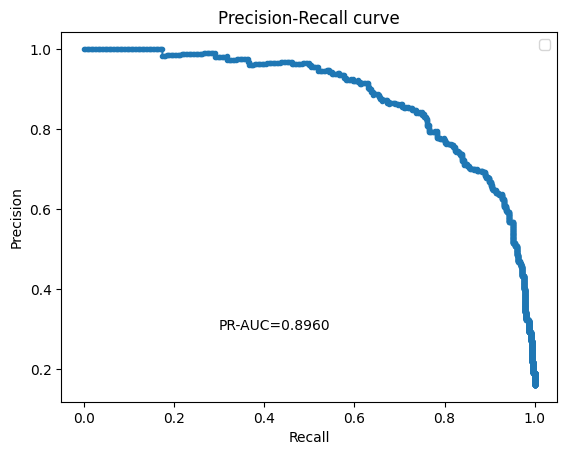

# Credit-Card-Attrition-Prediction-(PR-AUC = 0.8960)

Kaggle provides customer-level credit card usage data for predicting churn. In attrition_prediction.ipynb we load the BankChurners dataset, explore attrition drivers, and train a sequence of models - Logistic Regression, CatBoost, and a PyTorch neural network—to flag customers most at risk of leaving.

Source: [https://www.kaggle.com/datasets/thedevastator/predicting-credit-card-customer-attrition-with-m/data](url)


## Introduction

The notebook walks through the full churn-modeling pipeline: ingest the Kaggle dataset with kagglehub, inspect schema details, and run exploratory views on income tiers, transaction volume, utilization, and inactivity to quantify the 84/16 imbalance. Those findings guide a set of interpretable baselines (standard Logistic Regression and one with Weight-of-Evidence), followed by CatBoost, and a PyTorch multilayer perceptron trained with BCEWithLogitsLoss and Adam. Each stage logs PR-AUC, ROC-AUC, and F1 so that readers can compare the trade-offs between interpretability and lift.

## Dependencies

Pytorch, Pandas, Numpy, Matplotlib, Seaborn, Sklearn

## Exploratory Data Analysis


The dataset has an imbalanced attrition rate, with existing customers accounting for approximately 84% of the data. This imbalance should be considered when training the model. <p>
 <p>
Attrited customers tend to have lower total transaction counts compared to existing customers. The median transaction count for attrited customers is lower (41 vs 72), and their overall range of transaction counts is narrower compared to existing customers, indicating that lower engagement may be a strong predictor of attrition. <p>

<p>
Customers in the "Less than $40K" income category make up the largest share of the dataset and exhibit the highest attrition rate. This suggests a potential relationship between lower income levels and a higher likelihood of churn.

## Logistic Regression Baseline
To provide an interpretable reference point, the first experiment fits a class-balanced Logistic Regression model directly on the processed tabular features. The coefficients from this model highlight which behaviors (e.g., low transaction counts or lower income brackets) correlate most strongly with attrition risk.

```python
from sklearn.linear_model import LogisticRegression
from sklearn.metrics import auc, precision_recall_curve, roc_auc_score, f1_score
from sklearn.model_selection import train_test_split

X_train, X_test, y_train, y_test = train_test_split(
    X,
    y,
    test_size=0.2,
    random_state=42,
    stratify=y,
)

logreg = LogisticRegression(max_iter=1000, random_state=42, class_weight="balanced")
logreg.fit(X_train, y_train)

y_pred = logreg.predict(X_test)
y_pred_proba = logreg.predict_proba(X_test)[:, 1]

precision, recall, _ = precision_recall_curve(y_test, y_pred_proba)
pr_auc = auc(recall, precision)
roc_auc = roc_auc_score(y_test, y_pred_proba)
f1 = f1_score(y_test, y_pred)
```

This setup counters the 84/16 class imbalance, reports threshold-independent metrics (PR-AUC), and yields a transparent baseline to compare against the neural-network improvements.

The results are as follows:
* PR-AUC: 0.7287
* ROC-AUC: 0.9162
* F1 Score: 0.6370

## Logistic Regression with Weight of Evidence (WOE)
To highlight monotonic relationships between features and the binary target, the next experiment replaces raw inputs with Weight of Evidence encodings. Attrited customers are treated as events ($y=1$) while existing customers are non-events ($y=0$). For each binned feature we compute WOE and Information Value (IV):

```python
stats["woe"] = np.log(stats["dist_non_attrited"] / stats["dist_attrited"])
stats["iv"] = (stats["dist_non_attrited"] - stats["dist_attrited"]) * stats["woe"]
```

The resulting IV scores indicate which predictors contribute most to attrition discrimination. Top signals include Total_Trans_Ct (1.97), Total_Trans_Amt (1.93), Total_Revolving_Bal (1.08), Total_Ct_Chng_Q4_Q1 (0.96), and Avg_Utilization_Ratio (0.62). Features with IV below 0.1 are dropped, and the remaining WOE-transformed columns feed a second Logistic Regression model.

**Performance**
- PR-AUC: 0.8008
- ROC-AUC: 0.9354
- F1 Score: 0.6792

The WOE representation sharpens separation between churners and loyal customers, lifting all metrics relative to the raw-feature baseline while keeping the model coefficients easy to interpret.

## CatBoost
CatBoost is a gradient boosting library that natively understands categorical features and is widely used in credit analytics. Rather than one-hot encoding everything, we can simply list the categorical columns and let the algorithm apply target statistics and ordered boosting under the hood.

```python
# split data
X_train, X_test, y_train, y_test = train_test_split(
    df_catboost.drop('Attrition_Flag', axis=1),
    df_catboost['Attrition_Flag'],
    test_size=0.2,
    random_state=42,
    stratify=df_catboost['Attrition_Flag']
)

cat_vars = X_train.select_dtypes(include=['str']).columns.tolist()

catboost_model = CatBoostClassifier(
    iterations=1000,
    learning_rate=0.05,
    depth=6,
    random_seed=42,
    verbose=100
)

catboost_model.fit(
    X_train,
    y_train,
    eval_set=(X_test, y_test),
    early_stopping_rounds=50,
    cat_features=cat_vars
)

y_pred_catboost = catboost_model.predict(X_test)
y_pred_proba_catboost = catboost_model.predict_proba(X_test)[:, 1]
```
Training loss keeps dropping, but the validation set stops improving after roughly 500 iterations, so the overfitting detector rewinds to the best checkpoint (around iteration 480). Even with that guardrail, CatBoost still outperforms both logistic baselines:

- CatBoost PR-AUC: 0.9698
- CatBoost ROC-AUC: 0.9933
- CatBoost F1 Score: 0.9100

## Neural Network Model Training

First, we need to one-hot encode categorical variables before feeding them into the ML model. Since the dataset is fairly simple, we can build a 3 layer neural network. <p>
```python  
def __init__(self, input_size):  
    super().__init__()
    self.layer1 = nn.Linear(input_size, 64)  # Input size: 23  
    self.relu1 = nn.ReLU()
    self.layer2 = nn.Linear(64, 32)
    self.relu2 = nn.ReLU()
    self.dropout2 = nn.Dropout(0.2)
    self.layer3 = nn.Linear(32, 16)
    self.relu3 = nn.ReLU()
    self.output = nn.Linear(16, 1)
```  

The network will consist of Linear and ReLU layers for the classification tasks, with a Dropout layer for regularization to reduce overfitting. A Sigmoid layer is not necessary as we will use the BCEWithLogitsLoss loss function in the main loop; the optimizer used is Adam. After fine-tuning, a combination of a learning rate of 0.001 and a weight decay of 0.001 yields the highest and most stable training results.

After training for 200 epochs, the model achieved a PR-AUC of 0.8960, demonstrating strong performance in identifying churners under class imbalance.



-----
These models can be applied to:
- Identify customer segments with high attrition risk and proactively target them with personalized retention strategies.
- Analyze loyal customer segments to discover key drivers of retention, which can inform loyalty programs and targeted offerings.
- Prioritize marketing and resource allocation by estimating the potential return on investment (ROI) from retaining different customer groups.


